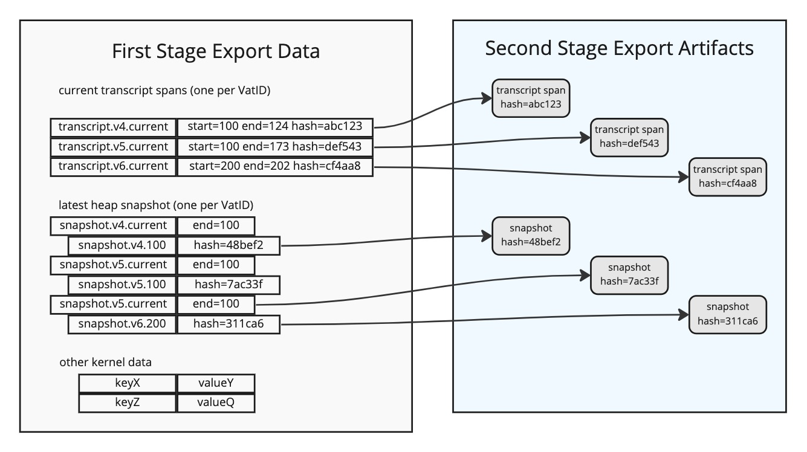
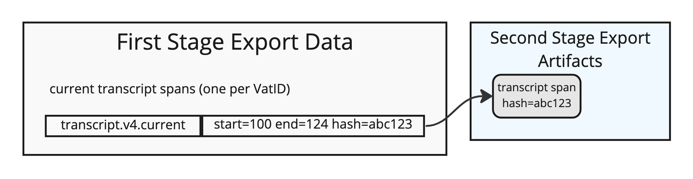
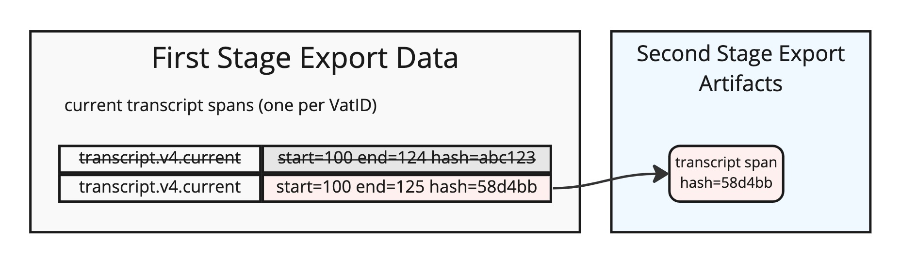
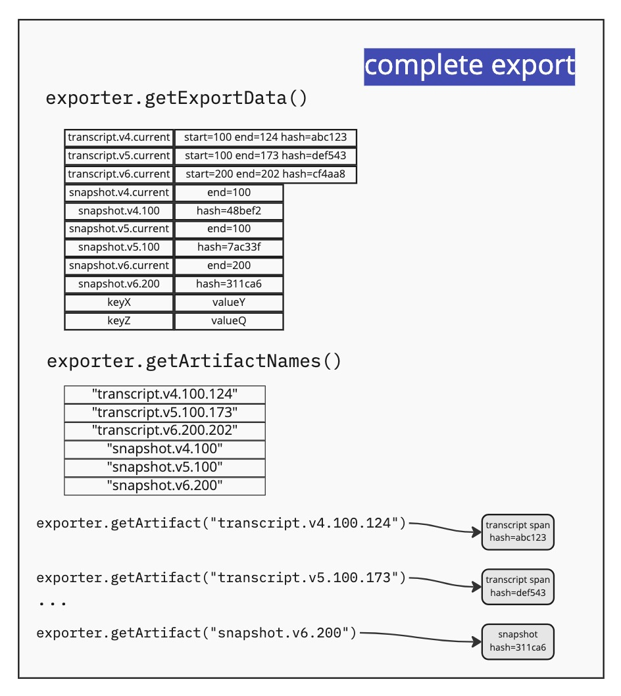
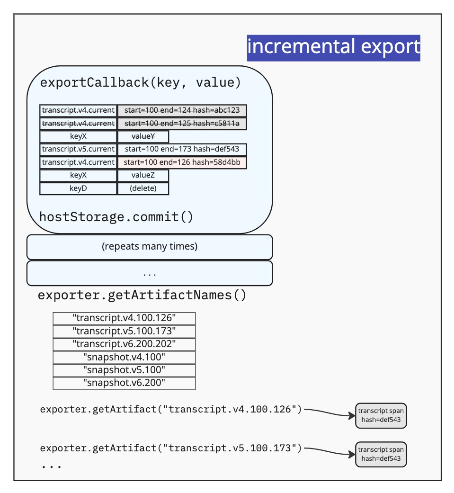

# SwingStore Data Import/Export

The "SwingStore" package provides the database-backed storage component that each SwingSet kernel uses to hold all necessary state. This includes message queues, c-list tables, XS heap snapshots, and vat delivery transcripts. The host application is responsible for creating a swingstore instance and passing it to the new kernel, and for committing the store's database at the appropriate point in the execution cycle.

Some applications may want to record their state changes in a way that can be cloned, to create new instances of the application. For example, a blockchain may consist of many "validators", each of which holds a replica of (hopefully) identical SwingSet kernel state, and we need a way to launch new validators and bring them quickly and cheaply up-to-date with the existing ones. We want the old validators to publish their SwingSet state, and for a prospective new validator node to be able to download this state as a starting point, rather than needing to replay the entire transaction/transcript history of the chain from the beginning. Some portion of this data may follow an untrusted path, so the new node must be able to validate the data it receives against some trust root. Typically there is a "block root hash" which they use as a starting point (which they either accept on faith from their operator, or which they somehow test against chain voting rules), then they can validate additional data against this root hash.

Blockchain platforms like cosmos-sdk have tools to implement "state-sync", so the library will handle data formatting and distribution. But at the application layer, we must provide the SwingStore state to this library in a suitable format. The cosmos-sdk state-sync tools require that 1: every block includes a commitment to the entire state of the application, and 2: every once in a while (perhaps once per day) the application will be asked for a set of "export artifacts". The combination of the current block's commitment and the export artifacts should be sufficient for a new participant to receive a state vector that can be safely validated against the current chain state.

Each SwingStore instance provides methods to facilitate this state export, and then to build a new SwingStore from the exported dataset. There is one set of methods to perform one-time full exports of the state. To facilitate consensus machines, a second set of methods are provided to perform incremental export of just the validation data, allowing the (large) remaining data to be exported only on rare occasions.

## Two Stages: Export Data and Export Artifacts

The SwingStore export protocol defines two stages (effectively two datasets). The contents of both are private to the SwingStore (the host application should make no assumptions about their contents or semantics). The first stage is called the "export data", and contains a set of key-value pairs (both strings). The second is a called the "export artifacts", each of which has a name (a string), and contains a blob of bytes. In general, the artifact blobs are much larger than the first-stage export data values, and take more time to generate. Host applications will typically not access the second-stage export artifacts until after the swingstore `commit()` is complete.



Each time a SwingStore API is used to modify the state somehow (e.g. adding/changing/deleting a `kvStore` entry, or pushing a new item on to a transcript), the contents of both datasets may change. New first-stage entries can be created, existing ones may be modified or deleted. And the set of second-stage artifacts may change.

These export data/artifact changes can happen when calling into the kernel (e.g. invoking the external API of a device, causing the device code to change its own state or push messages onto the run-queue), or by normal kernel operations as it runs (any time `controller.run()` is executing). When the kernel is idle (after `controller.run()` has completed), and `hostStorage.commit()` is called, the kernel will not make any changes to the SwingStore, and both datasets will be stable.

Among other things, the SwingStore records a transcript of deliveries for each vat. The collection of all deliveries to a particular vat since its last heap snapshot was written is called the "current span". For each vat, the first-stage export data will record a single record that remembers the extent and the hash of the current span. This record then refers to a second-stage export artifact that contains the actual transcript contents.



When a delivery is made, a new entry is appended to the end of the current span. This updates (replaces) the record in the first-stage export data: the new record has a longer extent (the `endPos` value is higher), and the span contents have a new hash. The second-stage export artifact is replaced as well: the name remains the same, but contents are now different.



To clone a SwingStore, the host application must extract both stages from the source copy, and somehow deliver them to a new instance of the application, which can feed both datasets into a new SwingStore. When complete, the destination SwingStore will have the same contents as the original, or at least enough to continue execution from the moment of copy (it may be lacking optional/historical data, like non-current vat transcripts from before the most recent heap snapshot).

The host application is responsible for delivering both datasets, but it is only responsible for maintaining the *integrity* of the first stage export data. This table contains enough information to validate the contents of the export artifacts. The new clone is entirely reliant upon the contents of the first stage: if someone can manage to corrupt its contents, the new clone may be undetectably and arbitrarily corrupted. But as long as the first stage was delivered correctly, any changes to the second stage export artifacts will be discovered by the new SwingStore, and the import process will abort with an error. This split reduces the cost of supporting occasional state-sync export operations, as described below.

## Full Export

The simplest (albeit more expensive) way to use SwingStore data export is by creating an "exporter" and asking it to perform a one-time full export operation.

The exporter is created by calling `makeSwingStoreExporter(dirpath)`, passing it the same directory pathname that was used to make your SwingStore instance. This API allows the exporter to use a separate SQLite database connection, so the original can continue executing deliveries and moving the application forward, while the exporter continues in the background. The exporter creates a new read-only SQLite transaction, which allows it to read from the old DB state even though new changes are being made on top of that checkpoint. In addition, the exporter can run in a thread or child process, so the export process can run in parallel with ongoing application work. This gives you as much time as you want to perform the export, without halting operations (however note that the child process must survive long enough to finish the export).

After calling `hostStorage.commit()`, the host application can extract the first-stage export data, and then the second-stage export artifacts:

```js
const dirPath = '.../swing-store';
const swingStore = openSwingStore(dirPath);
...
await controller.run();
hostStorage.commit();
// spawn a child process and wait for it to open a transaction
const started = makePromiseKit();
const child = fork(path, args);
child.on('error', started.reject);
child.on('exit', started.reject);
child.on('message', msg => {
  if (msg?.type === 'started') {
    started.resolve();
  }
});
await started.promise;
...

// child process does:
import { buffer } from 'node:stream/consumers';
const exporter = makeSwingStoreExporter(dirPath);
// exporter now has a txn, so parent process is free to proceed forward
process.send({ type: 'started' });
const exportData = new Map();
for (const [key, value] of exporter.getExportData()) {
  exportData.set(key, value);
}
const exportArtifacts = new Map();
for (const name of exporter.getArtifactNames()) {
  const reader = exporter.getArtifact(name);
  // reader is an async iterable of Uint8Array, e.g. a stream
  const data = await buffer(reader);
  exportArtifacts.set(name, data);
}
// export is the combination of 'exportData' and 'exportArtifacts'
```



When doing a complete export, the `getExportData()` iterator will only announce each first-stage key once.

Note that the new DB transaction is created during the execution of `makeSwingStoreExporter()`. If the exporter is run in a child process, the parent must ensure that it does not invoke the next `hostStorage.commit()` before the child reports that `makeSwingStoreExporter()` has completed. The export will capture the state of the SwingStore as of some particular commit, and we don't want to have a race between the parent finishing the next block, and the child establishing a transactional anchor on the state from the previous block.

## Incremental Export

The full export can be useful for backing up a "solo" swingset kernel, where consensus among multiple nodes is not required. However the more common (and complicated) use case is in a consensus machine, where multiple replicas are trying to maintain the same state. SwingStore offers an "incremental export" mode that is designed to work with the cosmos-sdk state-sync protocol.

In this protocol, every block must contain enough information (hashes) to validate the entire state-sync dataset, even though most blocks are not used for for state-sync (and only a very few replicas will volunteer to create state-sync data). All validators vote on the block hashes, and these blocks are widely reported by block explorers and follower/archive nodes, so it is fairly easy to answer the question "is this the correct root hash?" for an arbitrary block height.

When someone wants to launch a new validator, they ask around for an available state-sync snapshot. This will typically come from an archiving node, which produces a new snapshot each day. The archive node will report back the block height of their latest state-sync snapshot. The new validator operator must acquire a valid block header for that height, doing their own due diligence on the correctness of that header (checking its hash against public sources, etc). Then they can instruct their application to proceed with the state-sync download, which fetches the contents of the state-sync snapshot and compares them against the approved block header root hash.

So, to include SwingStore data in this state-sync snapshot, we need a way to get the first-stage export data (including its validation hashes) into every block, as cheaply as possible. We defer the more expensive second-stage export until a state-sync producing node decides it is time to make a snapshot.

To support this, SwingStore has an "incremental export" mode. This is activated when the host application supplies an "export callback" option to the SwingStore instance constructor. Instead of retrieving the entire first-stage export data at the end of the block, the host application will be continuously notified about changes to this data as the kernel executes. The host application can then incorporate those entries into an existing hashed Merkle tree (e.g. the cosmos-sdk IAVL tree), whose root hash is included in the consensus block hash. Every time the callback is given `(key, value)`, the host should add a new (or modify some existing) IAVL entry, using an IAVL key within some range dedicated to the SwingStore first-stage export data. When the callback receives `(key, undefined)` or `(key, null)`, it should delete the entry. In this way, the IAVL tree maintains a "shadow copy" of the first-stage export data at all times, making the contents both covered by the consensus hash, and automatically included in the cosmos-sdk IAVL tree where it will become available to the new validator as it begins to reconstruct the SwingStore.

The export callback must be established from the very beginning, so it includes all changes made during kernel initialization.

All validator nodes use this export callback, even if they never perform the rest of the export process, to ensure that the consensus state includes the entire first-stage dataset. (Note that the first stage data is generally smaller than the full dataset, making this relatively inexpensive).

Then, on the few occasions when the application needs to build a full state-sync snapshot, it can ask the SwingStore (after block commit) for the full set of artifacts that match the most recent commit.



```js
const dirPath = '.../swing-store';
const iavl = ...;
function exportCallback(key, value) {
  const iavlKey = `ssed.${key}`; // 'ssed' is short for SwingStoreExportData
  if (value === undefined) {
    iavl.delete(iavlKey);
  } else {
    iavl.set(iavlKey, value);
  }
}
const swingStore = openSwingStore(dirPath, { exportCallback });
...
await controller.run();
hostStorage.commit();

// now, if the validator is configured to publish state-sync snapshots,
// and if this block height is one of the publishing points,
// do the following:

// spawn a child process and wait for it to open a transaction
const started = makePromiseKit();
const child = fork(path, args);
child.on('error', started.reject);
child.on('exit', started.reject);
child.on('message', msg => {
  if (msg?.type === 'started') {
    started.resolve();
  }
});
try {
  await started.promise;
} catch (err) {
  ...
}
...

// child process does:
const exporter = makeSwingStoreExporter(dirPath);
process.send({ type: 'started' });
// note: no exporter.getExportData(), the first-stage data is already in IAVL
const artifacts = new Map();
for (const name of exporter.getArtifactNames()) {
  artifacts.set(name, exporter.getArtifact(name));
}
// instruct cosmos-sdk to include 'artifacts' in the state-sync snapshot
```

## Import

On the other end of the export process is an importer. This is used to restore kernel state, so that a new host application can simply continue mostly as if it had been previously executing. The expectation is that the import and the execution are 2 independent events, and the execution doesn't need to be aware it was imported.

For reference, after the initial state is created, each time the application is launched, it builds a controller around the existing state:

```js
import { openSwingStore } from '@agoric/swing-store';
import { makeSwingsetController } from '@agoric/swingset-vat';
const dirPath = './swing-store';
const { hostStorage, kernelStorage } = openSwingStore(dirPath);
const controller = await makeSwingsetController(kernelStorage);
// ... now do things like controller.run(), etc
```

When cloning an existing kernel, the host application first imports and commits the restored state using `importSwingStore`. The host application should feed the importer with the export data and artifacts, by passing an object that has the same API as the SwingStore's exporter:

```js
import { importSwingStore } from '@agoric/swing-store';
const dirPath = './swing-store';
const exporter = {
  getExportData() { // return iterator of [key,value] pairs },
  getArtifactNames() { // return iterator of names },
  getArtifact(name) { // return blob of artifact data },
};
const { hostStorage } = importSwingStore(exporter, dirPath);
// Update any hostStorage as needed
await hostStorage.commit();
await hostStorage.close();
// now the populated swingstore can be re-opened using `openSwingStore``
```

Once the new SwingStore is fully populated with the previously-exported data, the host application can update any host specific state before committing and closing the SwingStore. `importSwingStore` returns only the host facet of the SwingStore instance, as it is not suitable for immediate execution.

## Optional / Historical Data

Some of the data maintained by SwingStore is not strictly necessary for kernel execution, at least under normal circumstances. For example, once a vat worker performs a heap snapshot, we no longer need the transcript entries from before the snapshot was taken, since vat replay will start from the snapshot point. We split each vat's transcript into "spans", delimited by heap snapshot events, and the "current span" is the most recent one (still growing), whereas the "historical spans" are all closed and immutable. Likewise, we only really need the most recent heap snapshot for each vat: older snapshots might be interesting for experiments that replay old transcripts with different versions of the XS engine, but no normal kernel will ever need them.

Most validators would prefer to prune this data, to reduce their storage needs. But we can imagine some [extreme upgrade scenarios](https://github.com/Agoric/agoric-sdk/issues/1691) that would require access to these historical transcript spans. Our compromise is to record *validation data* for these historical spans in the export data, but omit the spans themselves from the export artifacts. Validators can delete the old spans at will, and if we ever need them in the future, we can add code that will fetch copies from an archive service, validate them against the export data hashes, and re-insert the relevant entries into the SwingStore.

Likewise, each time a heap snapshot is recorded, we cease to need any previous snapshot. And again, as a hedge against even more drastic recovery scenarios, we strike a compromise between minimizing retained data and the ability to validate old snapshots, by retaining only their hashes.

As a result, for each active vat, the first-stage Export Data contains a record for every old transcript span, plus one for the current span. It also contains a record for every old heap snapshot, plus one for the most recent heap snapshot, plus a `.current` record that points to the most recent snapshot. However the exported artifacts may or may not include blobs for the old transcript spans, or for the old heap snapshots.

The `openSwingStore()` function has an option named `keepTranscripts` (which defaults to `true`), which causes the transcriptStore to retain the old transcript items. A second option named `keepSnapshots` (which defaults to `false`) causes the snapStore to retain the old heap snapshots. Opening the swingStore with a `false` option does not necessarily delete the old items immediately, but they'll probably get deleted the next time the kernel triggers a heap snapshot or transcript-span rollover. Validators who care about minimizing their disk usage will want to set both to `false`. In the future, we will arrange the SwingStore SQLite tables to provide easy `sqlite3` CLI commands that will delete the old data, so validators can also periodically use the CLI command to prune it.

When exporting, the `makeSwingStoreExporter()` function takes an `artifactMode` option (in an options bag). This serves to both limit, and provide some minimal guarantees about, the set of artifacts that will be provided in the export. The defined values of `artifactMode` each build upon the previous one:

* `operational`: include only the current transcript span and current snapshot for each vat: just the minimum set necessary for current operations
* `replay`: add all transcript spans for the current incarnation
* `archival`: add all available transcript spans, even for old incarnations
* `debug`: add all available snapshots, giving you everything. The old snapshots are never necessary for normal operations, nor are they likely to be useful for extreme upgrade scenarios, but they might be useful for some unusual debugging operations or investigations

For each mode, the export will fail if the data necessary for those artifacts is not available (e.g. it was previously pruned). For example, an export with `artifactMode: 'replay'` will fail unless every vat has all transcript entries for each one's current incarnation. The `archival` mode will fail to export unless every vat has *every* transcript entry, back to the very first incarnation.

However the `debug` export mode will never fail: it merely dumps everything in the swingstore, without limits or completeness checks.

Note that `artifactMode` does not affect the Export Data generated by the exporter (because if we *ever* want to validate this optional data, the hashes are mandatory). It only affects the names returned by `getArtifactNames()`: `operational` returns a subset of `replay`, which returns a subset of `archival`. And re-exporting from a previously-pruned copy under `archival` mode will fail, because the second SwingStore cannot magically reconstruct the missing data.

Also note that when a vat is terminated, we delete all information about it, including transcript items and snapshots, both current and old. This will remove all the Export Data records, and well as the matching artifacts from `getArtifactNames`.

When importing, the `importSwingStore()` function's options bag takes a property named `artifactMode`, with the same meanings as for export. Importing with the `operational` mode will ignore any artifacts other than those needed for current operations, and will fail unless all such artifacts were available. Importing with `replay` will ignore spans from old incarnations, but will fail unless all spans from current incarnations are present. Importing with `archival` will fail unless all spans from all incarnations are present. There is no `debug` option during import.

While `importSwingStore()`'s options bag accepts the same options as `openSwingStore()`, since it returns only the host facet of a SwingStore, some of these options might not be meaningful, such as `keepTranscripts`.

So, to avoid pruning current-incarnation historical transcript spans when exporting from one swingstore to another, you must set (or avoid overriding) the following options along the way:

* the original swingstore must not be opened with `{ keepTranscripts: false }`, otherwise the old spans will be pruned immediately
* the export must use `makeSwingStoreExporter(dirpath, { artifactMode: 'replay'})`, otherwise the export will omit the old spans
* the import must use `importSwingStore(exporter, dirPath, { artifactMode: 'replay'})`, otherwise the import will ignore the old spans
  * subsequent `openSwingStore` calls must not use `keepTranscripts: false`, otherwise the new swingstore will prune historical spans as new ones are created (during `rolloverSpan`).

## Implementation Details

SwingStore contains components to accommodate all the various kinds of state that the SwingSet kernel needs to store. This currently consists of four portions:

* `kvStore`, a general-purpose string/string key-value table
* `transcriptStore`: append-only vat deliveries, broken into "spans", delimited by heap snapshot events
* `snapshotStore`: binary blobs containing JS engine heap state, to limit transcript replay depth
* `bundleStore`: code bundles that can be imported with `@endo/import-bundle`

Currently, the SwingStore treats transcript spans, heap snapshots, and bundles as export artifacts, with hashes recorded in the export data for validation (and to remember exactly which artifacts are necessary). The `kvStore` is copied one-to-one into the export data (i.e. we keep a full shadow copy in IAVL), because that is the fastest way to ensure the `kvStore` data is fully available and validated.

If some day we implement an IAVL-like Merkle tree inside SwingStore, and use it to automatically generate a root hash for the `kvStore` at the end of each block, we will replace this (large) shadow copy with a single `kvStoreRootHash` entry, and add a new export artifact to contain the full contents of the kvStore. This reduce the size of the IAVL tree, as well as the rate of IAVL updates during block execution, at the cost of increased CPU and complexity within SwingStore.
