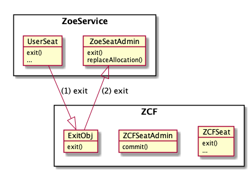
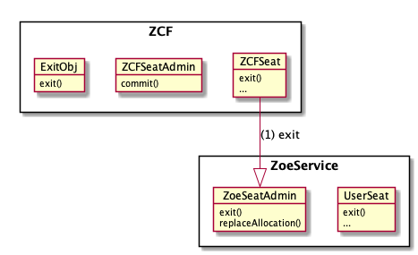
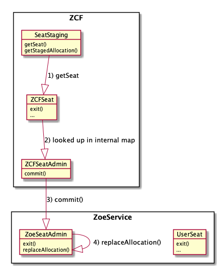

# Seats in the Zoe Service and Zoe Contract Facet

Note: These are internal documentation notes. For how to use Zoe and
how to develop smart contracts, please see
https://agoric.com/documentation/


__UserSeat.tryExit() Flow:__



__ZCFSeat.exit() Flow:__



__ZCF.reallocate() Flow:__




## UserSeat 

The `UserSeat` is what is returned when a user calls
`E(zoe).offer(invitation, proposal, payments, offerArgs, feePurse)`. It has the following
type:

```js
/**
 * @typedef {object} UserSeat
 * @property {() => Promise<Allocation>} getCurrentAllocation
 * @property {() => Promise<ProposalRecord>} getProposal
 * @property {() => Promise<PaymentPKeywordRecord>} getPayouts
 * @property {(keyword: Keyword) => Promise<Payment>} getPayout
 * @property {() => Promise<OfferResult>} getOfferResult
 * @property {() => void=} tryExit
 * @property {() => Promise<boolean>} hasExited
 * @property {() => Promise<Notifier<Allocation>>} getNotifier
 */
```

Note that `tryExit` is only present if the exit rule is `onDemand`. The
user can use the seat to get their payout, get the result of their
offer (whatever the contract chooses to return. This varies, but
examples are a string and an invitation for another user.)

## ZCFSeat

The `ZCFSeat` is a facet of the same seat, specifically for the
contract to manipulate. It is the `ZCFSeat` that is passed as the first
parameter to `offerHandlers`:

```js
const buyItems = buyerSeat => {
  const proposal = buyerSeat.getProposal();
  const moneyGiven = buyerSeat.getAmountAllocated('Money', moneyBrand);
  ...
```
The type of the ZCFSeat is:

```js
/**
 * @typedef {object} ZCFSeat
 * @property {() => void} exit
 * @property {ZCFSeatFail} fail
 * @property {() => Notifier<Allocation>} getNotifier
 * @property {() => boolean} hasExited
 * @property {() => ProposalRecord} getProposal
 * @property {ZCFGetAmountAllocated} getAmountAllocated
 * @property {() => Allocation} getCurrentAllocation
 * @property {() => Allocation} getStagedAllocation
 * @property {() => boolean} hasStagedAllocation
 * @property {(newAllocation: Allocation) => boolean} isOfferSafe
 * @property {(amountKeywordRecord: AmountKeywordRecord) => AmountKeywordRecord} incrementBy
 * @property {(amountKeywordRecord: AmountKeywordRecord) => AmountKeywordRecord} decrementBy
 * @property {() => void} clear
 */
 ```

## ZoeSeatAdmin

Internal to Zoe Service code and passed to ZCF. Never external.

The `ZoeSeatAdmin` is the administrative facet of a seat within Zoe.
When `exit()` is called on this object, the payouts accessible through
the `UserSeat` are resolved. `replaceAllocation` changes the Zoe
allocation to the `replacementAllocation`.

The type of the `ZoeSeatAdmin` is:

```js
/**
 * @typedef {object} ZoeSeatAdmin
 * @property {(allocation: Allocation) => void} replaceAllocation
 * @property {ZoeSeatAdminExit} exit
 * @property {ShutdownWithFailure} fail called with the reason
 * for calling fail on this seat, where reason is normally an instanceof Error.
 */
 ```
