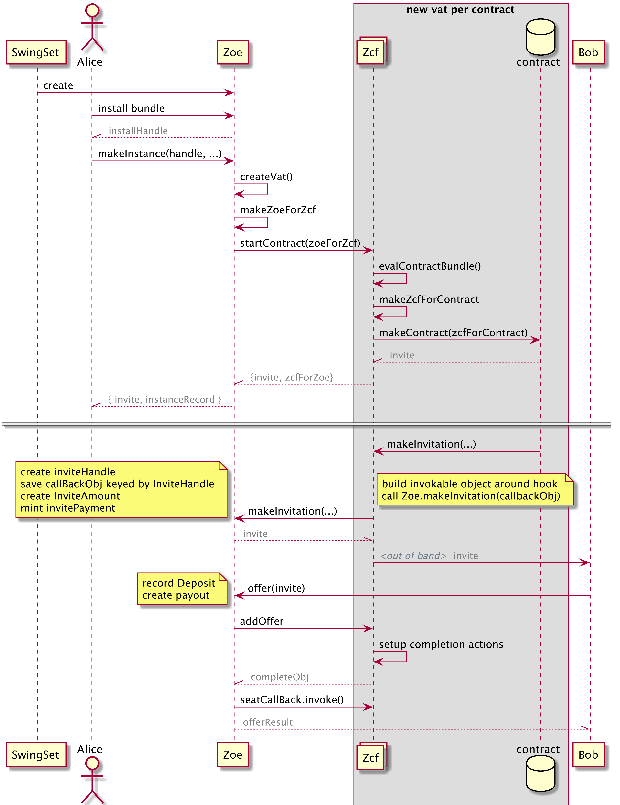

# Zoe and ZCF

Zoe, the package, is split into two parts: the Zoe Service (what users
interact with) and the Zoe Contract Facet (aka ZCF, an API exposed to
contract code that interacts with the Zoe Service). The Zoe service is
in a single, continuously-running vat on its own. Each time a contract
is instantiated with `E(zoe).startInstance()`, a new vat is created
with a fresh ZCF object, and the contract code is executed. (From here
on, `zoe` the object refers to the Zoe Service.)

 * 

## Files in the Zoe Service and ZCF

Zoe has been split up into a number of smaller files which isolate and
attenuate authority. For example, all escrow purses are created in
`escrowStorage.js` and there is no access to the purses outside the
file. Instead, a few functions are returned, including the ability to
`createPurses`, `depositPayments`, and `withdrawPayments`. This makes
analysis of authority somewhat simpler: to see who/what has the power
to withdraw from the escrow purses, trace the usages of
`withdrawPayments`. In this case, it is only used once, to create a
payout when a seat is exited. (In hindsight, this file probably should
have been part of a larger division that also included checks of offer
safety and rights conservation during reallocations, as Zoe 2.0 does
in the Escrow Service). To learn more about this approach, see
[Handling Authority in ERTP and Zoe](./handling-authority.md).

Below are some other files that are organized in this way, with their
purposes:

* installationStorage.js
   - Handles everything related to installations, and exposes two
     functions: `install` and `unwrapInstallation`
* makeInvitation.js
   - attenuates the ability to mint NFTs with the invitation brand
* instanceAdminStorage.js
   - Stores the instanceAdmins (the internal objects in Zoe which
     store state for the contract instances)
* issuerStorage.js
   - Stores all issuers that have been registered with Zoe and
     retrieves and stores their brands and displayInfo
* instanceRecordStorage.js
   - Stores information about a contract instance, such
     as the terms, issuers, brands, etc. 
* createZCFVat.js
   - Attenuates the ability to create a new vat by only exposing a
     function that creates a new vat with ZCF code and not other code.

## Interactions between Zoe and Zcf

The Zoe Service is started on-chain in `packages/vats/vat-zoe.js`  Any
user can call `E(zoe).install(bundle)` to deploy code on-chain and
thus create a new "installation" for the contract code. An
installation is an object that can be used for its identity to compare
whether the code used in different contract instances is the same. In
the future
([Issue](https://github.com/Agoric/agoric-sdk/issues/3871)), a user
will be able to get the hash of the code from an installation, so that a user can
compare the hash with the hash of code hosted off-chain.

Anyone with an `installation` can ask the Zoe Service to create a new
instance of a contract with a particular assignment of keywords to
Brands, and specified terms. When the Zoe Service receives the
`E(zoe).startInstance()` call, it creates a new vat (getting the vat's
root object in return) and a new object `zoeInstanceAdminForZcf` which
serves as the ZCF vat's main connection to Zoe. 

Zoe then calls `E(zcfRoot).executeContract()` to start the contract.
The parameters include a promise for the Zoe Service, the source
bundle, the invitation Issuer, `zoeInstanceAdminForZcf`, the instance
record, issuer records, and any private arguments.

The code in the ZCF Vat evaluates the contract bundle, makes a ZCF
object for the contract's use, and calls the contract's start
function (which must be exported as either `start` or `prepare`).
The contract can return any or all of the following: a
`publicFacet` (accessible to anyone with the contract instance), a
`creatorFacet` (an ocap only given to the owner of a contract), and a
`creatorInvitation` (an invitation only given to the owner of a
contract). ZCF passes these on from the contract to Zoe and Zoe
returns them to the caller of `E(zoe).startInstance()`. ZCF also
returns to Zoe an object solely for communicating an offer to ZCF:
`handleOfferObj`.
### Making an Invitation and Exercising an Offer

The Zoe Service creates and holds the mint for invitations. The Zoe
Service freely shares the corresponding issuer, so everyone can verify
invitations.

When an invitation is exercised (`E(zoe).offer(invitation, ..., payments, ...)`), Zoe
burns the invitation, escrows the payments, calls
`E(handleOfferObj).handleOffer`, which informs ZCF that a new offer
has been made, and returns a newly created `userSeat`. `handleOffer`
in ZCF calls the `offerHandler`, the particular function that the
contract code registered when it called `zcf.makeInvitation`. ZCF
records what it needs to know about the offer, then returns two things
to Zoe: a promise for the offerResult (the return value from the
`offerHandler`) and an `exitObj` that Zoe saves for later use.

In order to ensure that the `zcf` object in the contract vat has
synchronous access to the most up-to-date information about
seats that have exited, if a user calls `userSeat.tryExit()`, the
Zoe Service calls `E(exitObj).exit()`. This ensures that even when the
user originates the request, the exit process always goes through the
contract vat first.

### Security Claims and Further Details

Creating a new contract installation is the only way in which users
can add code to the Agoric blockchain. The contract code should not be
able to adversely affect the functioning of the Zoe Contract Facet,
despite being within the same vat.

For example, “rights conservation” and “offer safety” are enforced in
the contract facet, and no contract should be able to violate either.
All contract code must not be able to adversely affect the functioning
of the Zoe Service.

Eventually, the Zoe Service may be split into multiple vats, but for now, all of the assets that Zoe escrows (including the assets for all of the users of the contracts that run on the Agoric chain) are escrowed in the single Zoe Service vat.

Contracts by default are private: unless the contract gives you an object by which you can get access, you do not have *any* access to the contract.

Zoe specifically uses the [@agoric/ertp](../../ERTP) implementation for contract
invitations, but when Zoe escrows assets for use in contracts, Zoe does not verify that the assets were made using the latest [@agoric/ertp](../../ERTP) implementation. 

A user can only receive an invitation to a contract instance if the contract code calls `zcf.makeInvitation(...`, which goes through the proper channels and asks Zoe to mint the invitation. No other contract code or other channel can create an invitation for a contract instance.

In addition to allowing developers to deploy code and create their own contract instances on the Agoric chain, Zoe provides protections to users of contracts:

* Offer safety: a guarantee that when the user receives a payout from a smart contract, it will be what they wanted or a full refund of what they offered
* Payout liveness: a guarantee that the user will receive a payout in a timely fashion according to the conditions in their offer

In order for Zoe to enforce offer safety and payout liveness:
* Zoe escrows assets for users. Contracts do not have access to the users’ assets. 
When users make an “offer” through Zoe, users must specify what they are giving and what they want in return. This is in the form of a `proposal` object record with `want` and `give` properties, with specific ERTP amounts given and wanted.
* Instead of getting direct access to assets, contract code can only work with “allocations” - records within Zoe of which amounts are currently allocated to which seat. 
* Contract code can reallocate amounts among seats but *only if* two safety properties hold:
  - Offer safety: for this particular seat, is the user’s want satisfied, or the user’s give satisfied? At least one must be satisfied or the reallocation fails.
  - Rights conservation: For all the seats we are reallocating over,
    have we accidentally gained or lost tokens? If so, the
    reallocation fails.
* ZCF in the contract vat enforces offer safety and rights conservation on every reallocation. Because allocations start in a position of offer safety (the initial allocation is what the user gave), and can only change if offer safety holds, allocations are always in an offer safe state for every offer. Additionally, rights (assets/tokens) are always conserved, as any reallocation must maintain the same amount as before. 
* All payouts to users must go through Zoe. When a user makes an offer, they specify an “exit” rule. For example, the exit rule “onDemand” allows a user to exit the contract instance at any time according to the wishes of the user. “onDemand” is the strongest user protection. Other exit rules are “waived” (the user entirely waives the right to exit and can only exit when the contract code exits the corresponding seat) and “afterDeadline” (the seat will automatically exit the contract after the deadline specified, according to the timer specified.). Note that the contract code can exit a seat at any time, so by the time a user decides to exit, the contract code could have already exited that seat. 
* Payout liveness requires that if the exit rule is “onDemand”, and the user tries to exit the seat, the contract code cannot prevent the user from receiving a payout, and the user receives their payout from Zoe in a time consistent with the normal processing time of withdrawing payments. 

IMPORTANT: The full payout liveness guaranteed by Zoe is conditional on well-behaved issuers. Zoe does not protect users nor promise to protect users from misbehaving issuers. For example, when Zoe tries to create a payout for a user, Zoe is withdrawing payments from the purses that Zoe holds in escrow. Under the hood, this is interacting with the issuers for these different assets. It is very possible that one of the issuers never returns a payment or returns something other than a payment, or many other ways of misbehaving. This is not a violation of payout liveness, as users are required to carefully choose the issuers that they rely on, and Zoe can only enforce payout liveness for well-behaved issuers.

A misbehaving issuer should only affect Zoe in the following ways:
1. Bad payout payments: 
   - When a user has an allocation that includes an amount for a misbehaving issuer, the user will still receive a payout object.
   - In the payout object, the user receives separate promises for
     each payment, which resolve separately. If a misbehaving issuer
     does not return a payment or never resolves the promise for the
     payment, the other payments in the payout are unaffected.
   - Only the payment for the misbehaving issuer is affected.
2. Creating a purse hangs or fails:
   - Zoe attempts to create an empty purse when first hearing of an issuer from the creator of a contract instance (in `startInstance`) or the contract code (`saveIssuer`) itself. 
   - If `E(issuer).makeEmptyPurse()` errors, the `startInstance` or `saveIssuer` calls should error as well. 
3. Getting the brand/displayInfo hangs or fails:
   - Zoe stores the brand and displayInfo (decimalPlaces and other information to use for display in UI) for an issuer.
   - If this fails, ‘startInstance’ or ‘saveIssuer’ should fail.
4. Depositing hangs or fails:
   - When a user makes an offer, and depositing a payment into Zoe’s purse for that issuer fails or hangs, then the offer call does not succeed, and any funds that were successfully deposited into the Zoe purses are no longer accessible to the user.
   - We have a ticket for giving the user a refund of what was already
     deposited, and offer safety and payout liveness are still
     meaningful as long as issuers are well-behaved. For more, see
     https://github.com/Agoric/agoric-sdk/issues/1271
   - See packages/zoe/src/zoeService/escrowStorage.js for the Zoe code that does deposits and payout withdrawals.

- Users can get a surprise payout payment of a brand that they didn’t specify in their proposal, if the contract code allocates an amount of that brand to their seat. This could be a misbehaving issuer, so the user’s risk is not limited to only what they specify in their proposal. However, the only downside is that the unexpected payment is junk and cannot be deposited/used, which may not be important to the user.
 - If a user decides to rely on a misbehaving issuer, other users of the same contract who did not rely on the misbehaving issuer should not be affected.
 - Contract instances that use misbehaving issuers should not negatively affect other contract instances.
 - Misbehaving issuers should not be able to affect the deposit/withdrawal process for other issuers in the Zoe Service.

We want to ensure there are no potential race conditions in updating allocations. An offer creates an initial allocation from the Zoe side into ZCF, but all subsequent updates come from ZCF to Zoe. We must ensure that an update from Zoe into ZCF can never cross paths with an update from ZCF into Zoe. 
