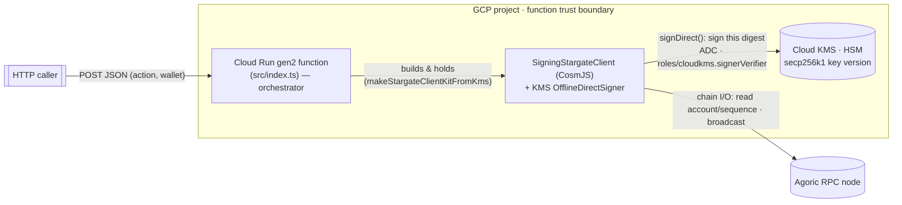
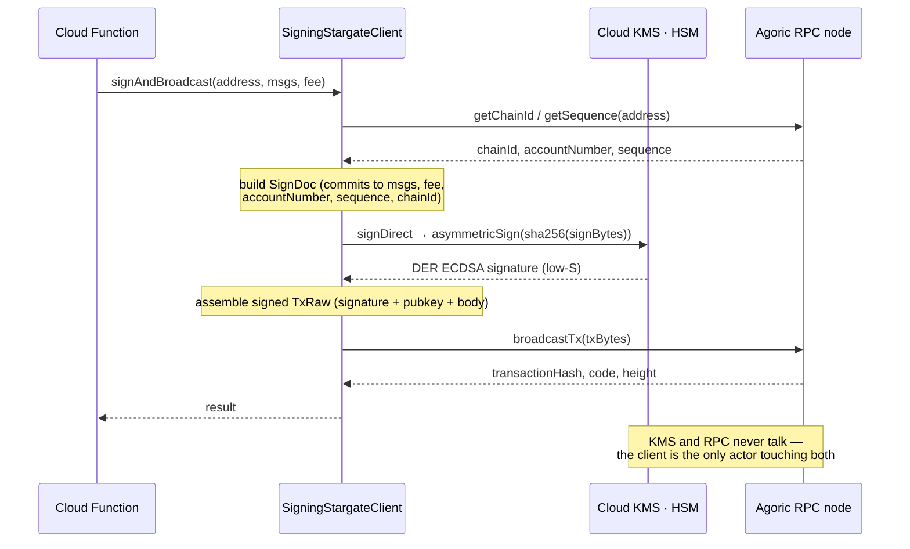
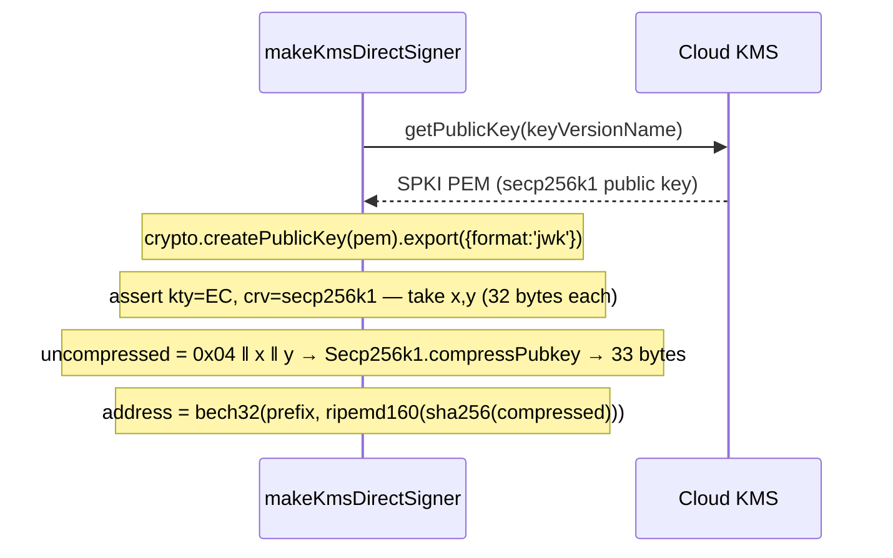
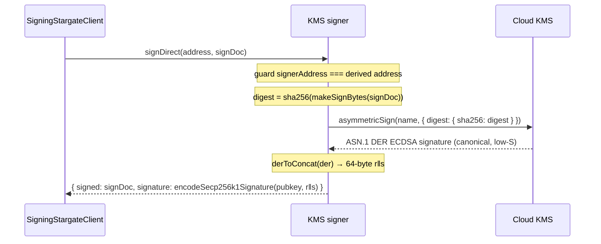

# KMS-backed Agoric transaction signing

**Status:** Proof of concept (approved design for the POC in this package).
**Scope:** Sign Agoric (Cosmos SDK) transactions with a secp256k1 private key that
is generated inside Google Cloud KMS and is **non-exportable** — the signing
process never holds the key. Deployed as a Cloud Run gen2 function.
**Non-goals:** a production custody service, on-demand wallet creation, endpoint
authorization design. Those are called out under [Future work](#future-work).

This document is the design companion to the code in this package. It mirrors the
implementation (`src/`) and explains the reasoning behind it. For the exhaustive,
copy-paste deployment walkthrough and glossary, see the [README](../README.md);
for the "create a wallet per user" extension, see
[`docs/on-demand-wallets.md`](../docs/on-demand-wallets.md).

---

## 1. Motivation

Signing an Agoric transaction requires a secp256k1 private key. The conventional
approach keeps that key as a BIP-39 mnemonic / raw private key that some process
must load into memory to sign. Anywhere that key is materialized — an env var, a
mounted secret, a `.env` file, a process heap — is a place it can leak.

Google Cloud KMS offers a stronger custody model: a key can be **generated inside
an HSM and never exported**. Callers do not receive the key; they ask KMS to sign
a digest and receive back a signature. If we can drive CosmJS's signing path
entirely through KMS `asymmetricSign`, then an Agoric signer can exist with **no
private key anywhere in the application's trust boundary**.

The open question this POC answers: *can a standard CosmJS
`SigningStargateClient` broadcast a real Agoric transaction whose signature was
produced by a non-exportable KMS key, with no code changes to agoric-sdk
packages?* The answer is yes, and the mechanism is below.

## 2. Goals and non-goals

**Goals**

- Produce Agoric-valid secp256k1 signatures using only KMS `asymmetricSign`; the
  private key never leaves the HSM.
- Present as a drop-in CosmJS `OfflineDirectSigner`, so the existing
  `SigningStargateClient` broadcast path works unchanged.
- Stay a self-contained package that builds and deploys from its own directory,
  depending only on published packages — no monorepo build, no edits to
  `@agoric/client-utils` or any other workspace package.
- Demonstrate the end-to-end proof on chain: provision a smart wallet and/or
  broadcast a `MsgWalletSpendAction` signed by KMS.

**Non-goals (deliberately out of scope for the POC)**

- On-demand / per-user wallet creation (see `docs/on-demand-wallets.md`).
- Authorization of the HTTP endpoint itself (the runbook deploys
  `--allow-unauthenticated` for convenience; see [Security](#7-security-model)).
- Amino (legacy) sign mode — only `SIGN_MODE_DIRECT` is implemented, which is all
  `SigningStargateClient.signAndBroadcast` needs.
- Automated funding of wallets — a fresh wallet is empty and cannot pay its own
  fee, so funding is an external, manual step.

## 3. Architecture

The running system has four actors: the Cloud Run function, the CosmJS
`SigningStargateClient` it builds, Cloud KMS, and the Agoric RPC node. The single
most important relationship to understand is that **KMS and the RPC never
communicate with each other** — they sit on two independent axes (signing vs.
chain I/O), and the `SigningStargateClient` is the only actor that spans both.

### 3.1 Components and wiring

- **Cloud Run function** (`src/index.ts`) — the orchestrator. A single HTTP
  handler, `sign`, built by buildpacks (no `Dockerfile`). It selects a wallet,
  builds the client kit, and drives provision/broadcast. It holds no key.
- **`SigningStargateClient` + KMS signer** — the **hub**. The CosmJS client
  (built by `makeStargateClientKitFromKms`) is the only actor that touches both
  sides: it uses the RPC for chain I/O and calls the embedded KMS-backed
  `OfflineDirectSigner` (`src/kms-direct-signer.ts`) for signatures. The signer
  is the reusable core; it imports only published deps and Node builtins so it
  can later be lifted into `@agoric/client-utils`.
- **Cloud KMS** — key custody plus the signing primitive. It does exactly two
  things: `getPublicKey` (once, at signer construction) and `asymmetricSign`
  (once per transaction). It is chain-blind: it signs a 32-byte digest and knows
  nothing of transactions, sequence numbers, or the RPC.
- **Agoric RPC node** — the chain gateway. The client reads account number,
  sequence, and chain ID from it, and broadcasts the finished transaction to it.
  It is KMS-blind (see §3.2).

Configuration (`src/config.ts`) wires these together: it names which KMS key
version(s) back which wallet(s) and supplies the RPC endpoint and address prefix
— resource *names* only, never key material.

The function authenticates to KMS with **Application Default Credentials** picked
up from the metadata server (no key files, no mounted secrets); the runtime
service account holds only `roles/cloudkms.signerVerifier` on the key (it can
sign; it cannot create or destroy keys).

### 3.2 Runtime interaction (one broadcast)

A single `signAndBroadcast` interleaves RPC reads with one KMS sign, and the
client carries data between the two services — which never talk to each other:

The order is forced by what a signature must commit to: **read chain state (RPC)
→ sign (KMS) → broadcast (RPC).** The `SignDoc` bakes in the `accountNumber` and
`sequence` (replay protection) and `chainId`, all read from the RPC, so the KMS
sign cannot happen until the RPC has returned them. (§4.2 zooms into the
`signDirect` step itself; `index.ts` also does a pre-flight `getBalance` — another
RPC read — before it will provision or spend.)

Two asymmetries fall out of this, and together they are why the private key can
stay locked in the HSM:

- **KMS is chain-blind.** It receives a 32-byte digest and returns a signature;
  it never sees a transaction or the RPC.
- **The chain is KMS-blind.** The broadcast transaction carries the *public key*
  in its `AuthInfo`, so the node verifies the signature with the public key alone
  — it never contacts KMS. Verification needs no secret.

## 4. The signing core

`makeKmsDirectSigner({ keyVersionName, prefix, kmsClient? })` returns a CosmJS
`OfflineDirectSigner`. CosmJS's broadcast path only ever calls two methods on a
signer — `getAccounts()` and `signDirect()` — so implementing exactly those makes
this a straight substitute for `DirectSecp256k1HdWallet`.

### 4.1 Address derivation (one KMS round-trip, cached)

On construction the signer fetches the public key **once** and caches the derived
account, so steady-state signing is exactly one `asymmetricSign` call per
transaction.

Design choices here:

- **Parse the PEM with the Node `crypto` builtin** (`export({ format: 'jwk' })`)
  rather than adding an ASN.1 dependency. KMS returns the public key as SPKI PEM;
  JWK export gives the raw `x`/`y` curve coordinates directly.
- **Compress the key** with `@cosmjs/crypto`'s `Secp256k1.compressPubkey`. Cosmos
  addresses and `StdSignature` pubkeys use the 33-byte compressed form.
- **Standard Cosmos address derivation**: `ripemd160(sha256(compressedPubkey))`
  (via `rawSecp256k1PubkeyToRawAddress`) bech32-encoded with the chain prefix
  (`agoric`). This yields exactly the `agoric1…` address the chain expects, which
  is what makes an address funded by a faucet controllable by the KMS key.

### 4.2 The sign path

`signDirect(signerAddress, signDoc)` reproduces what CosmJS's local signer does,
but sends the digest to KMS instead of computing the signature locally:

Key correctness points:

- **What gets signed.** Cosmos `SIGN_MODE_DIRECT` signs `sha256(SignDoc bytes)`.
  We compute that digest and hand it to KMS with the
  `EC_SIGN_SECP256K1_SHA256` algorithm, whose contract is "I am giving you a
  SHA-256 digest; sign it." KMS signs the digest as-is (it does not re-hash), so
  the bytes signed are identical to the local path.
- **Address guard.** `signDirect` throws if asked to sign for an address other
  than the one this signer derived — a defensive check against a mis-wired caller
  signing with the wrong key.

### 4.3 DER → compact signature conversion

KMS returns the signature as ASN.1 DER: `SEQUENCE { INTEGER r, INTEGER s }`.
CosmJS/Cosmos wants a fixed 64-byte `r ‖ s` (each a 32-byte big-endian scalar).
`derToConcat` does this conversion, handling the DER encoding rules explicitly:

- Each `INTEGER` may carry a leading `0x00` pad when its high bit is set (DER
  keeps integers positive), or may be **shorter** than 32 bytes when leading
  zeros are dropped. `toField32` strips the pad and left-pads to exactly 32
  bytes.
- The parser rejects malformed input rather than guessing: wrong sequence/integer
  tags, long-form or indefinite lengths (a secp256k1 signature is always short
  enough for single-byte lengths), a sequence-length mismatch, or an `r`/`s`
  wider than 32 bytes all raise.
- **No S-normalization is applied.** secp256k1 ECDSA signatures are malleable
  (both `s` and `n − s` verify), and Cosmos rejects high-S signatures. Cloud KMS
  already returns **canonical low-S** signatures for secp256k1, so the value is
  chain-valid as received. This is asserted by the fuzz test in
  `test/der-to-concat.test.ts`, which cross-checks `derToConcat` against CosmJS's
  own `Secp256k1Signature` for many random signatures.

### 4.4 Client kit

`makeStargateClientKitFromKms({ keyVersionName, prefix, rpcAddr, ... })` wraps the
signer in a `SigningStargateClient` and returns `{ address, client }` — the same
shape the mnemonic-based path returns, so callers substitute one for the other.
It registers the two Agoric message types the POC needs:

- `/agoric.swingset.MsgWalletSpendAction`
- `/agoric.swingset.MsgProvision`

The Agoric proto types are **lazily imported** from the published
`@agoric/cosmic-proto` only on this path. That keeps the core module importable by
the pure unit tests (and by any future consumer) without a built copy of a
workspace package, and keeps the `@google-cloud/kms` value import off the hot path
as well (the KMS client is likewise imported lazily via `getDefaultKmsClient`).

### 4.5 SES / hardened-JS friendliness

The signer applies the ambient `harden` to its returned objects **if** a lockdown
has installed one (`maybeHarden`), and is otherwise the identity. This lets the
module drop into a hardened Agoric runtime without requiring one for the
standalone POC.

## 5. Configuration and the wallet model

`loadConfig(env)` reads configuration from the environment; **no key material is
ever in the environment** — only *resource names* that identify which KMS key
version to use.

| Env var            | Meaning                                                                 |
| ------------------ | ---------------------------------------------------------------------- |
| `KMS_KEY_VERSION`  | One fully-qualified CryptoKeyVersion resource name (single wallet).     |
| `KMS_KEY_VERSIONS` | Comma-/newline-separated list of resource names (several wallets).      |
| `PREFIX`           | bech32 address prefix; defaults to `agoric`.                            |
| `RPC`              | Agoric RPC endpoint; required to report balances, provision, broadcast. |
| `AGORIC_NET`       | Informational network label.                                            |

Design decisions:

- **One KMS key version = one wallet = one address.** A KMS key version *is* one
  secp256k1 keypair. Because the key is non-exportable it is **not** BIP-32/HD
  derivable — there is no seed from which many child addresses descend. So each
  wallet is its own key version. This is the fundamental custody tradeoff: you
  give up "many addresses from one seed" to keep every key inside the HSM.
  Scaling is therefore *operational* — create N key versions and list them — and
  a single deployment can serve them all, selected per request by index.
- **Fail fast on malformed key names.** Every entry must match the full
  `projects/…/cryptoKeyVersions/<n>` pattern (`KMS_KEY_VERSION_PATTERN`). A bare
  key name or a mistyped key ring is rejected at load time rather than surfacing
  as an opaque error at first sign.
- **Safe wallet selection.** `selectWalletIndex` defaults an absent selector to
  wallet `0` and rejects a non-integer or out-of-range index, so a bad request
  fails cleanly instead of signing with the wrong (or a missing) key.

## 6. HTTP action model

The `sign` handler multiplexes on the request body:

| Request body                                   | Action                                                                     |
| ---------------------------------------------- | -------------------------------------------------------------------------- |
| `{ "action": "list" }`                         | Enumerate every configured wallet: `{ index, address, pubkey }`.           |
| `{ "wallet": n }` (no `spendAction`/`action`)  | Return one wallet's address; if `RPC` is set, also its BLD balance + `funded`. |
| `{ "action": "provision", "wallet": n }`       | Self-submit `MsgProvision` (`SMART_WALLET`) to turn the account into a smart wallet. |
| `{ "spendAction": "…", "wallet": n }`          | Broadcast `MsgWalletSpendAction` — the end-to-end proof.                    |

Design decisions:

- **Funding guard.** A fresh wallet holds no BLD and cannot pay a fee. Before
  provisioning or spending, the handler checks the balance and returns an
  actionable `409` ("fund it first") instead of letting the chain emit an opaque
  insufficient-fee error. Funding itself is external (faucet or a funded account)
  — the service cannot fund itself.
- **Explicit, proportional fees.** A plain spend uses a modest default fee
  (`gas 400000`, `10000ubld` ≈ 0.01 BLD, mirroring the `client-utils` default at
  the recommended min gas price); provisioning runs SwingSet work and so uses a
  proportionally larger fee (`gas 2500000`, `62500ubld`).
- **Provisioning is idempotent on chain.** Re-provisioning an already-provisioned
  wallet is a no-op error surfaced in the returned tx `code`, not a crash.

## 7. Security model

**What this design protects.** The secp256k1 private key is generated in and never
leaves the KMS HSM. The function process only ever holds the *public* key and
*signatures*. Compromise of the running function does not yield the key: an
attacker who fully owns the process can request signatures **only while they hold
that access**, and cannot exfiltrate the key for later or offline use.

**Trust boundaries and authorities.**

- **KMS access is IAM, not a secret.** The runtime SA holds only
  `roles/cloudkms.signerVerifier` on the specific key. Creating/destroying keys
  requires the separate, more powerful `roles/cloudkms.admin`, kept off the
  signing path. Revoking the IAM binding instantly and centrally disables signing
  — there is no leaked key still valid after revocation.
- **No ambient key material.** ADC is obtained from the metadata server; there
  are no key files or mounted secrets, and the environment carries only resource
  *names*.

**Out of scope for the POC (must be addressed before production).**

- **Endpoint authorization.** The runbook uses `--allow-unauthenticated` for
  convenience, which means *anyone who can reach the URL can ask the key to
  sign*. That effectively delegates the KMS authority to the open internet. A
  real deployment must drop that flag (require `roles/run.invoker` identity
  tokens) and add application-level authorization deciding *who may sign what*.
- **What may be signed.** The POC signs whatever provision/spend request it
  receives for the selected wallet; it does not constrain message contents.
- **Replay / rate limiting / audit** of sign requests are not addressed here.

## 8. Testing strategy

- **Deterministic unit tests, no GCP.** `test/signer.test.ts`,
  `test/der-to-concat.test.ts`, `test/address-derivation.test.ts`, and
  `test/config.test.ts` run against a **mocked** `KmsSigningClient` and pinned
  fixtures. `KmsSigningClient` is declared as a minimal local interface precisely
  so the signer is loadable and testable without the real `@google-cloud/kms`
  client. The DER test fuzzes `derToConcat` against CosmJS's own signature
  parser; the address test pins a known PEM → compressed pubkey → `agoric1…`
  vector.
- **Opt-in live integration.** `test/kms.integration.test.ts` exercises a real
  KMS key over ADC and is **skipped unless `RUN_KMS_INTEGRATION` is set**, so the
  default `yarn test` never touches live GCP or CI billing.

## 9. POC runbook

The authoritative, copy-paste steps (with prerequisites, IAM, and cleanup) live
in the [README runbook](../README.md#runbook-deploy-and-test-on-google-cloud-the-primary-path).
In brief, the order is always **create → fund → provision → use**:

1. **Create wallets.** `gcloud kms keyrings create …`, then one
   `gcloud kms keys create … --purpose asymmetric-signing
   --default-algorithm ec-sign-secp256k1-sha256 --protection-level hsm` per
   wallet. HSM protection is **required** — KMS only supports the `secp256k1`
   curve on HSM keys.
2. **Grant signing.** Bind the runtime SA to `roles/cloudkms.signerVerifier` on
   each key (nothing more).
3. **Deploy.** `gcloud functions deploy … --gen2 --entry-point sign
   --source services/kms-signer-poc --env-vars-file …/env.yaml`, with
   `KMS_KEY_VERSIONS` and `RPC` set.
4. **List → fund → provision.** `POST {"action":"list"}` for addresses; fund each
   from a faucet/funded account; `POST {"action":"provision","wallet":n}`.
5. **Proof.** A `provision` (or `spendAction`) response with a `transactionHash`
   and `"code": 0` is a real Agoric transaction signed by a key that never left
   KMS.

## 10. Alternatives considered

- **Mnemonic in Secret Manager.** Simpler and HD-derivable (many addresses from
  one seed), but the key is materialized in the process to sign — exactly the
  exposure this POC removes. KMS trades HD derivation for non-exportability.
- **Patch `@agoric/client-utils` directly.** Rejected for the POC to keep it a
  self-contained, independently deployable unit and avoid touching shared
  packages before the approach is proven. Lifting the vendored signer into
  `client-utils` is the intended follow-up.
- **Amino sign mode.** Unnecessary — `SigningStargateClient` uses
  `SIGN_MODE_DIRECT`, so only `OfflineDirectSigner` is implemented.

## 11. Future work

- **Lift the signer into `@agoric/client-utils`.** `kms-direct-signer.ts` was
  written vendored and published-deps-only specifically so it can graduate into
  the shared library once proven.
- **On-demand / per-user wallets.** Create key versions at request time from a
  user→key mapping store, with an IAM split between the "wallet factory" and the
  signing path. Design sketch in
  [`docs/on-demand-wallets.md`](../docs/on-demand-wallets.md).
- **Production hardening.** Endpoint authorization, per-request sign-authorization
  policy, audit logging, and rate limiting (see [Security](#7-security-model)).

## 12. References

- Implementation: `src/kms-direct-signer.ts`, `src/config.ts`, `src/index.ts`.
- Operational runbook and glossary: [`README.md`](../README.md).
- On-demand wallet extension: [`docs/on-demand-wallets.md`](../docs/on-demand-wallets.md).
- Cloud KMS asymmetric signing: `EC_SIGN_SECP256K1_SHA256` (HSM protection level).
- CosmJS signing: `OfflineDirectSigner`, `SigningStargateClient`, `makeSignBytes`.
