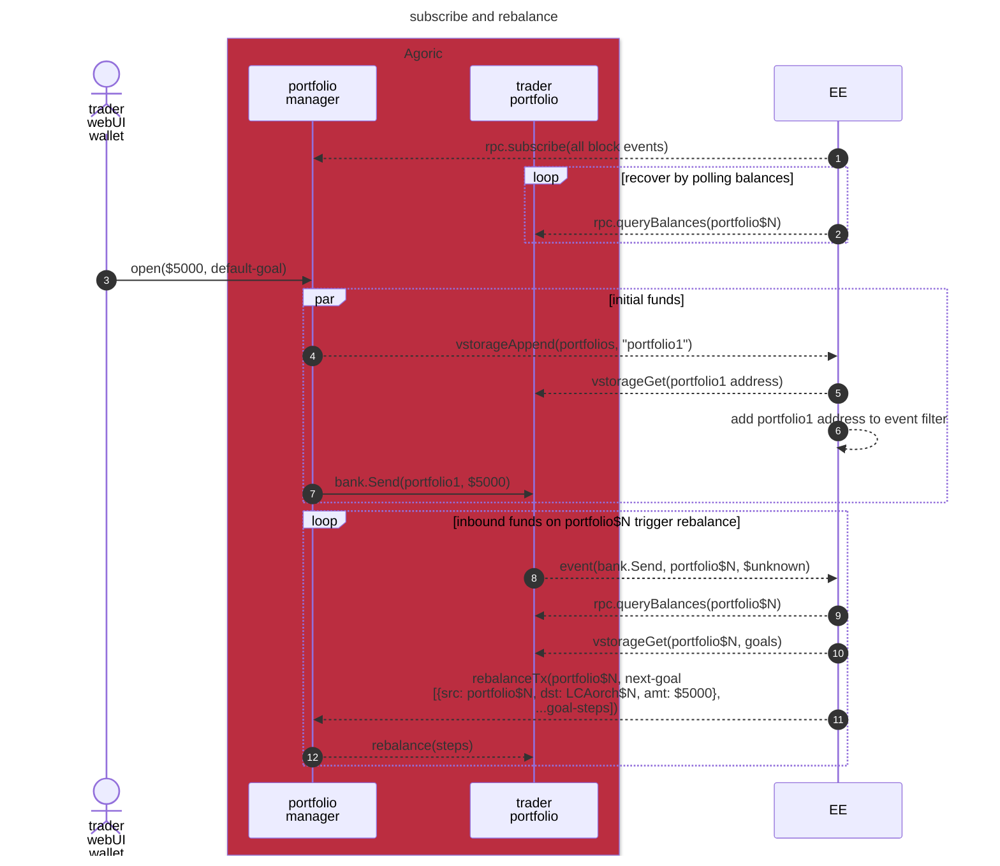

# Portfolio Planner

### Subscribe to portfolios and rebalance



## Development

### Prerequisites

Node.js and yarn per [agoric-sdk Prerequisites](../../README.md#prerequisites).

### Setup

1. Install dependencies:
```bash
yarn install
```
2. Optionally run a local Docker version of the planner's dependencies:
```bash
yarn start:deps
```

### Local Development

```bash
yarn dev
```

This starts the development server with hot reloading.

### Testing

```bash
yarn test
```

## Configuration

Environment variables:

- `AGORIC_NET`: agoric.net subdomain for requesting URL path `/network-config` to identify `chainName`/`rpcAddrs`/etc. (default `main`)
- `ALCHEMY_API_KEY`: API key for accessing Alchemy’s Ethereum RPC endpoint (optional, but necessary for using that service)
- `MNEMONIC`: For the private key used to sign transactions (required)
- `SPECTRUM_API_URL`: URL for the [Spectrum](https://spectrumnodes.com/) API (default `https://pools-api.spectrumnodes.com`)
- `SPECTRUM_API_TIMEOUT`: Milliseconds to wait for each Spectrum request (default `10000` = 10 seconds)
- `SPECTRUM_API_RETRIES`: Retry count for Spectrum requests (default `3`)
- `DOTENV`: Path to environment file containing defaults of above (default `.env`)

## Architecture


## License

Apache-2.0
