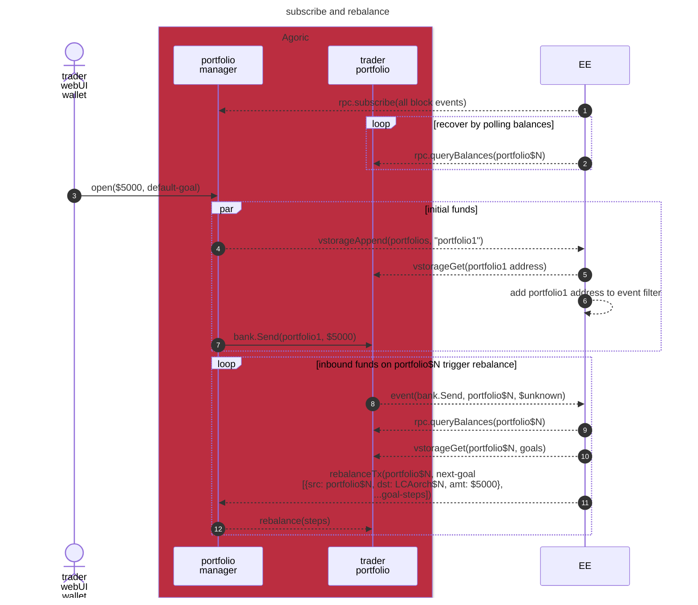

# Portfolio Planner

### Subscribe to portfolios and rebalance



## Development

### Prerequisites

Node.js and yarn per [agoric-sdk Prerequisites](../../README.md#prerequisites).

### Setup

1. Install dependencies:
```bash
yarn install
```
2. Optionally run a local Docker version of the planner's dependencies:
```bash
yarn start:deps
```

### Codegen

Build type-aware representations of GraphQL APIs under [src/graphql](./src/graphql):
```bash
yarn codegen && yarn lint:graphql
```

### Local Development

```bash
yarn dev --dry-run
```

This starts the development server with hot reloading (omit `--dry-run` to make
the planner actually sign and submit actions rather than just logging them).

### Testing

```bash
yarn test
```

### Manual Transaction Tool

A unified tool for manually processing and resolving transactions:

```bash
./scripts/tx-tool.ts <command> [options]
```

#### Commands

**scan** - Process a pending transaction by reading from vstorage
```bash
./scripts/tx-tool.ts scan <txId> [--verbose]
```

Examples:
```bash
./scripts/tx-tool.ts scan tx233
./scripts/tx-tool.ts scan tx233 --verbose
```

Use cases:
- Re-process a transaction that may have been skipped or failed
- Debug transaction processing issues
- Manually trigger transaction handling in development/testing

**settle** - Manually mark a transaction as succeeded or failed
```bash
./scripts/tx-tool.ts settle <txId> <status> [reason]
```

Examples:
```bash
./scripts/tx-tool.ts settle tx399 success
./scripts/tx-tool.ts settle tx400 fail "Transaction timeout"
./scripts/tx-tool.ts settle tx401 fail "Unable to confirm on destination chain"
```

Use cases:
- Manually resolve stuck transactions
- Administrative cleanup of transaction states
- Document specific failure reasons for audit purposes

Run `./scripts/tx-tool.ts` without arguments to see full usage.

#### Setup for Local Use

These tools are intended for **debugging and manual intervention**, run locally by developers:

1. **Configure environment** - Set up your `.env` with the target network config (production, testnet, or local):
   - RPC endpoints
   - Contract addresses
   - Mnemonic
   - Other service configuration

2. **Set database path** - Point `SQLITE_DB_PATH` to a local file:
   ```bash
   SQLITE_DB_PATH=./local-dev.db
   ```
   Use a local database file path that exists on your machine.

**Usage scenarios:**
- Debug transaction processing issues
- Manually settle stuck transactions
- Test transaction handling against testnet or production data

#### Required Environment Variables

These tools use the same configuration as the main planner service. You can use a `.env` file or set environment variables directly.

## Configuration

Environment variables:

- `CLUSTER`: "local", "testnet", or "mainnet" to specify the respective
  collection of networks to use, in which "local" is currently incomplete and
  overlaps with "testnet" (default derived from `AGORIC_NET`).
  This setting is also used to derive the correct `axelarApiUrl` for the selected network cluster.
- `AGORIC_NET`: network specifier per
  [Agoric SDK Environment Variables](../../docs/env.md), either "$subdomain" for
  requesting MinimalNetworkConfig from URL
  [https://$subdomain.agoric.net/network-config](https://all.agoric.net/) or
  "$subdomain,$chainId" or "$fqdn,$chainId" for sending cosmos-sdk RPC requests
  to $subdomain.rpc.agoric.net or $fqdn (respectively) and assuming the chain ID
  (default derived from `CLUSTER`, falling back to "local")
- `CONTRACT_INSTANCE`: Contract instance identifier, either "ymax0" (dev) or "ymax1" (prod) (required)
- `ALCHEMY_API_KEY`: API key for accessing Alchemy's RPC endpoint (required, but not verified at startup)
  - **Important**: For all EVM chains in `AxelarChain` (see `packages/portfolio-api/src/constants.js`), ensure they are enabled in your Alchemy dashboard.
- `GCP_PROJECT_ID`: For fetching an unset `MNEMONIC` from the Google Cloud Secret Manager (default "simulationlab")
- `GCP_SECRET_NAME`: For fetching an unset `MNEMONIC` from the Google Cloud Secret Manager (default "YMAX_CONTROL_MNEMONIC")
- `MNEMONIC`: For the private key used to sign transactions (optional, but if not provided then it will be retrieved from the Google Cloud Secret Manager using `GCP_PROJECT_ID` and `GCP_SECRET_NAME`)
- `DEPOSIT_BRAND_NAME`: For identifying funds to manage by matching against `issuerName` in vstorage data at path "published.agoricNames.vbankAsset" (default "USDC")
- `FEE_BRAND_NAME`: For identifying how to pay [Axelar Cosmos–EVM] transfer fees by matching against `issuerName` in vstorage data at path "published.agoricNames.vbankAsset" (default "BLD")
- `REQUEST_TIMEOUT`: Milliseconds to wait for each external request (default "10000" = 10 seconds)
- `REQUEST_RETRIES`: Retry count for external requests (default "3")
- `COSMOS_REST_TIMEOUT`: Overrides `REQUEST_TIMEOUT` for Agoric/Noble/etc. Cosmos REST APIs (optional)
- `COSMOS_REST_RETRIES`: Overrides `REQUEST_RETRIES` for Agoric/Noble/etc. Cosmos REST APIs (optional)
- `GRAPHQL_ENDPOINTS`: JSON text for a Record\<dirname, url[]> object describing endpoints associated with each api-\* GraphQL API directory under [graphql](./src/graphql) (optional)
- `SQLITE_DB_PATH`: The path where the SQLiteDB used by the resolver should be created. While a relative path can be provided (relative to the cwd),
an absolute path is recommended
- `YDS_URL`: Base URL of the YMax Data Service API, for sending transaction settlement notifications (optional)
- `YDS_API_KEY`: API key for authenticating with YDS (required with `YDS_URL`)
- `DOTENV`: Path to environment file containing defaults of above (default ".env")

## Architecture


## License

Apache-2.0
